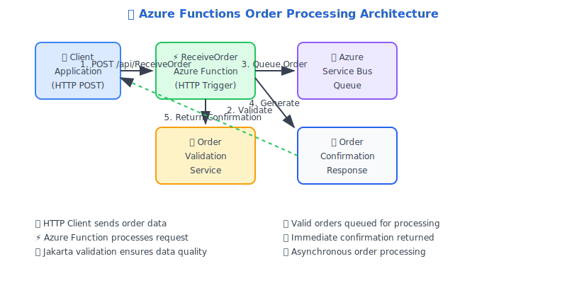

# ⚡ Azure Functions Java Demo 🚀

<div align="center">


**A comprehensive demonstration of Azure Functions in Java with order processing capabilities** 📦

</div>

## 🎯 Purpose

This repository showcases a **production-ready Azure Functions application** built with Java, demonstrating:

- 🔧 **HTTP-triggered serverless functions**
- ✅ **Jakarta Bean Validation** for request validation
- 🚌 **Azure Service Bus integration** for message queuing
- 📋 **Complete order processing workflow**
- 🏗️ **Enterprise-ready architecture patterns**

Perfect for developers learning Azure Functions with Java or looking for a solid foundation for serverless order processing systems!

## 🏗️ Architecture Overview



## 📁 Repository Structure

```
📁 Azure-Functions-Java-Demo/
├── 📄 pom.xml                                    # Maven configuration & dependencies
├── 📄 host.json                                  # Azure Functions runtime configuration
├── 📁 src/main/java/com/christopherhouse/functions/
│   ├── ⚡ ReceiveOrder.java                      # Main order processing function
│   ├── 📁 models/                               # Data transfer objects
│   │   ├── 📋 OrderRequest.java                 # Incoming order model with validation
│   │   ├── ✅ OrderConfirmation.java            # Response confirmation model
│   │   ├── 📦 LineItem.java                     # Individual order item model
│   │   └── 🏷️ OrderStatus.java                  # Order status enumeration
│   └── 📁 services/
│       └── ✅ OrderValidation.java              # Jakarta Bean Validation service
└── 📁 target/                                   # Build output (auto-generated)
    └── 📁 azure-functions/                      # Packaged function app
```

## 🚀 Functions & Services

### ⚡ ReceiveOrder Function

The **main HTTP-triggered function** that orchestrates the complete order processing workflow:

**🔧 Functionality:**
- **HTTP Trigger**: Accepts `POST` requests to `/api/ReceiveOrder`
- **JSON Deserialization**: Converts incoming JSON to `OrderRequest` objects
- **Order Validation**: Uses Jakarta Bean Validation for comprehensive data validation
- **Service Bus Integration**: Forwards valid orders to Azure Service Bus queue
- **Response Generation**: Returns `OrderConfirmation` with processing status

**📊 Input/Output:**
```java
// Input: OrderRequest JSON
{
  "customerName": "John Doe",
  "customerEmail": "john.doe@example.com",
  "customerPhone": "555-1234",
  "shippingAddress": "123 Main St",
  "paymentMethod": "Credit Card",
  "orderDate": "2025-01-01",
  "orderStatus": "NEW",
  "orderId": "ORDER-001",
  "customerId": "CUST-001",
  "lineItems": [
    {
      "productId": "PROD-001",
      "productName": "Demo Product",
      "quantity": 2,
      "unitPrice": 29.99
    }
  ]
}

// Output: OrderConfirmation JSON
{
  "orderId": "ORDER-001",
  "customerName": "John Doe",
  "customerEmail": "john.doe@example.com",
  "orderDate": "2025-01-01",
  "orderStatus": "RECEIVED",
  "totalAmount": 59.98
}
```

### 📋 Data Models

#### OrderRequest Model
**Rich domain model** with comprehensive validation:
- ✅ **@NotNull** validations for required fields
- 📧 **@Email** validation for customer email
- 📝 **@NotEmpty** validation for line items
- 🔢 **@Min** validation for quantities
- 💰 **@DecimalMin** validation for prices

#### LineItem Model
**Encapsulates individual order items** with automatic calculations:
- 🧮 **Automatic total calculation**: `getTotalPrice() = quantity * unitPrice`
- ✅ **Built-in validation** for product data integrity

#### OrderConfirmation Model
**Response model** providing order processing confirmation with calculated totals.

### ✅ OrderValidation Service

**Enterprise-grade validation service** using Jakarta Bean Validation:
- 🏭 **Factory Pattern**: Uses `Validation.buildDefaultValidatorFactory()`
- 🔍 **Comprehensive Validation**: Validates all model constraints
- 📊 **Detailed Error Reporting**: Provides specific violation messages
- 🛡️ **Exception Handling**: Graceful handling of validation errors

## 🛠️ Development Workflow

### 🔧 Prerequisites

- ☕ **Java 11+** (OpenJDK recommended)
- 📦 **Maven 3.6+**
- ⚡ **Azure Functions Core Tools v4+**
- 🌐 **Internet connection** (for extension bundles)

### 🏗️ Build Process

```bash
# 1️⃣ Clean build
mvn clean compile          # 🕐 ~60 seconds first run, ~2 seconds cached

# 2️⃣ Package for deployment
mvn package               # 🕐 ~130 seconds first run, ~6 seconds cached

# 3️⃣ Run tests
mvn test                  # 🕐 ~2 seconds (no tests currently)
```

### 🚀 Local Development

```bash
# 🔧 Install Azure Functions Core Tools (if not installed)
npm install -g azure-functions-core-tools@4

# 🎯 Start local Functions runtime
func start --java --prefix target/azure-functions/DemoOrderFunction-1754659291844

# 🌐 Function will be available at:
# POST http://localhost:7071/api/ReceiveOrder
```

### 📋 Manual Testing

Create test file `/tmp/test_order.json`:
```json
{
  "customerName": "Jane Smith",
  "customerEmail": "jane.smith@example.com",
  "customerPhone": "555-9876",
  "shippingAddress": "456 Oak Avenue",
  "paymentMethod": "Credit Card",
  "orderDate": "2025-01-15",
  "orderStatus": "NEW",
  "orderId": "ORDER-002",
  "customerId": "CUST-002",
  "lineItems": [
    {
      "productId": "PROD-002",
      "productName": "Sample Product",
      "quantity": 1,
      "unitPrice": 49.99
    }
  ]
}
```

Test with curl:
```bash
curl -X POST http://localhost:7071/api/ReceiveOrder \
  -H "Content-Type: application/json" \
  -d @/tmp/test_order.json
```

### ⚙️ Configuration

#### Service Bus Connection

Configure `local.settings.json` in the function app directory:
```json
{
  "IsEncrypted": false,
  "Values": {
    "FUNCTIONS_WORKER_RUNTIME": "java",
    "serviceBusConnectionString": "Endpoint=sb://your-namespace.servicebus.windows.net/;SharedAccessKeyName=your-key;SharedAccessKey=your-secret"
  }
}
```

### 🚀 Deployment

```bash
# 🌐 Deploy to Azure
mvn azure-functions:deploy

# 📊 View deployment status
az functionapp show --name DemoOrderFunction-1754659291844 --resource-group java-functions-group
```

## 🔍 Key Technologies

| Technology | Version | Purpose |
|------------|---------|---------|
| ☕ **Java** | 11+ | Core runtime |
| ⚡ **Azure Functions** | 3.0.0 | Serverless platform |
| ✅ **Jakarta Validation** | 3.0.2 | Request validation |
| 🔧 **Hibernate Validator** | 7.0.5 | Validation implementation |
| 📋 **Jackson Databind** | 2.14.2 | JSON processing |
| 📦 **Maven** | 3.6+ | Build automation |
| 🧪 **JUnit Jupiter** | 5.4.2 | Testing framework |

## 💡 Features

- ✅ **Enterprise Validation**: Comprehensive request validation using Jakarta Bean Validation
- 🚌 **Message Queuing**: Asynchronous order processing via Service Bus
- 🔄 **Error Handling**: Graceful handling of invalid requests and processing errors
- 📊 **Automatic Calculations**: Built-in order total calculations
- 🏗️ **Scalable Architecture**: Serverless design for automatic scaling
- 🛡️ **Type Safety**: Strong typing with comprehensive data models
- 📋 **Structured Logging**: Built-in logging through Azure Functions runtime

## 🤝 Contributing

1. 🍴 Fork the repository
2. 🌟 Create a feature branch (`git checkout -b feature/amazing-feature`)
3. 💾 Commit your changes (`git commit -m 'Add amazing feature'`)
4. 🚀 Push to the branch (`git push origin feature/amazing-feature`)
5. 🔄 Open a Pull Request

## 📜 License

This project is licensed under the MIT License - see the [LICENSE](LICENSE) file for details.

---

<div align="center">

**⭐ Don't forget to star this repository if it helped you! ⭐**

Made with ❤️ for the Azure Functions community

</div>